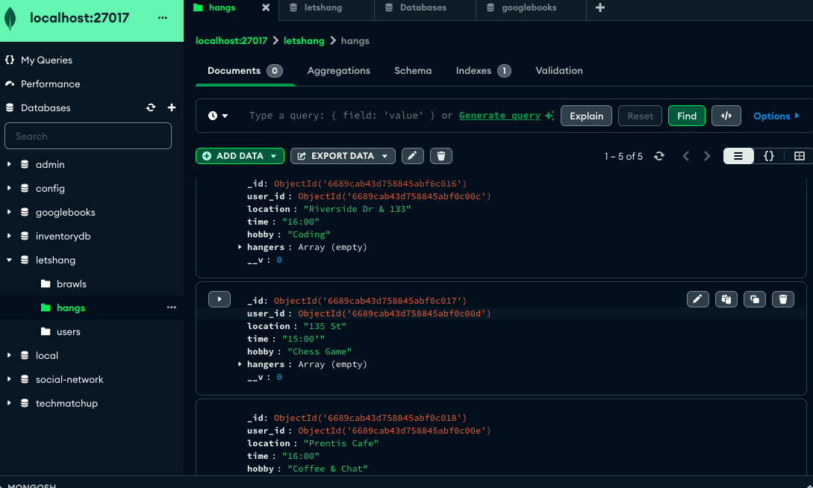

#  "Let's Hang" : A Legit Hangout & Brawl MERN Application 


## Objective 
An Interactive Application with purpose to connect people in small areas for hobbies,  or even better... brawls! 

  Repository: https://github.com/kitasauce/Lets_Hang

  Render Active Website: 


## Application Requirements

```

* Use React for the front end.

* Use GraphQL with a Node.js and Express.js server.

* Use MongoDB and the Mongoose ODM for the database.

* Use queries and mutations for retrieving, adding, updating, and deleting data.

* Be deployed using Render (with data).

* Have a polished UI.

* Be responsive.

* Be interactive (i.e., accept and respond to user input).

* Include authentication (JWT).

* Protect sensitive API key information on the server.

* Have a clean repository that meets quality coding standards (file structure, naming conventions, best practices for class and id naming conventions, indentation, high-quality comments, etc.).

* Have a high-quality README (with unique name, description, technologies used, screenshot, and link to deployed application).
```
## Pre-Brawl Set Up

```
This Application utilizes: 

-GraphQL
-Node.js
-Express.js
-MongoDB
-Mongoose ODM
```

Ensure all are installed and functional on your device. 

Once repo is cloned and on VS Code ensure to ensure all dependancies are installed with the following: 

```

1. npm install 
2. npm run seed 


```

## Installation

Right click, Run Terminal and start the fun with: 

```
npm run develop

```

## Screenshots





(Yay, Authentication and Storage works! )

``` 

Thanks for Hangin' with us!

```


## Contributors
```
Andrew Zubac @ kitasauce
Kat dacoda @ KatVela24
Gina Bauza @ SongBirdCode (Tweet, Tweet!) 
Justin Boston @ justinboston 
```
## License

© All Rights Reserved to contributors and MIT


